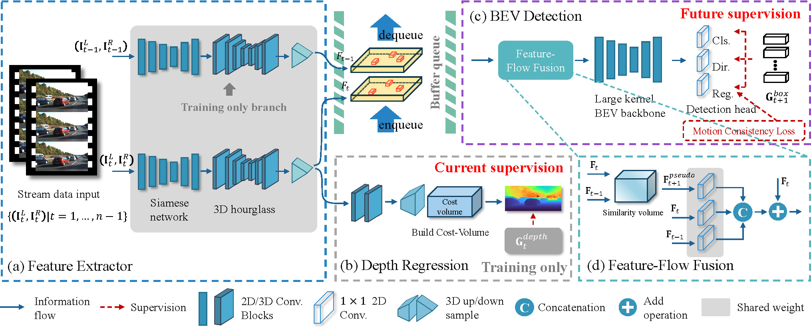

# StreamDSGN


This is the official anonymous repository for the paper "Real-time Stereo-based 3D Object Detection for Streaming Perception".

### Model Framework

<p align="center"> </p>

### Data Preparation 

(1) Download the [KITTI 3D tracking dataset](https://www.cvlibs.net/datasets/kitti/eval_tracking.php) including velodyne, stereo images, and calibration matrices. Then move the ```extra_data/planes.zip``` to ```data/kitti/training/``` directory and unzip it.

The folders are organized as follows:

```tree
ROOT_PATH
├── data
│   ├── kitti_tacking
│   │   │── training
│   │   │   ├──calib & velodyne & label_2 & image_2 & image_3 & planes
├── pcdet
├── mmdetection-v2.22.0
```

(2) Generate KITTI tracking split file.

```bash
python tools/gen_split_kitti_tracking.py --save_split --sample_mode 3
```

(3) Generate KITTI data list and joint Stereo-Lidar Copy-Paste database for training.

```bash
python -m pcdet.datasets.kitti_streaming.lidar_kitti_streaming create_kitti_infos 

python -m pcdet.datasets.kitti_streaming.lidar_kitti_streaming create_gt_database_only --image_crops
```

Keep in mind that put the pre-computed road plane to ```./kitti_tracking/training/planes``` for precise copy-paste augmentation. 

### Installation

(1) Install mmcv-1.4.0 library. 
```bash
# pycocotools==2.0.2 requires a lower version of cython
pip install cython==0.29.36
pip install pycocotools==2.0.2
pip install torch==1.7.1 torchvision==0.8.2
mim install mmcv-full==1.4.0
```

(2) Install the spconv library.
```bash
sudo apt install libboost-dev
git clone https://github.com/traveller59/spconv --recursive
cd spconv
git reset --hard f22dd9
git submodule update --recursive
python setup.py bdist_wheel
pip install ./dist/spconv-1.2.1-xxx.whl
```

(3) Install the included mmdetection-v2.22.0.
```bash
cd mmdetection-v2.22.0
pip install -e .
```

(4) Install OpenPCDet library.
```bash
pip install tqdm timm scikit-image==0.21.0 scikit-learn==1.3.0
pip install -e .
```

### Training and Inference

(1) Get model inference time for streaming simulations.
```bash
python tools/gen_infer_time.py --cfg_file configs/stream/kitti_models/stream_dsgn_r18-token_prev_next-feature_align_avg_fusion-lka_7-mcl.yaml
```
Please ensure that the inference time is faster than the frame interval, as this is the core of end-to-end streaming perception.


(2) Then train the model by
```bash
python tools/train.py --cfg_file configs/stream/kitti_models/stream_dsgn_r18-token_prev_next-feature_align_avg_fusion-lka_7-mcl.yaml --fix_random_seed
```

(3) We provide checkpoints in the ```extra_data/checkpoint_epoch_20.pth``` directory. You can evaluate the model directly by
```bash
python tools/test.py --cfg_file configs/stream/kitti_models/stream_dsgn_r18-token_prev_next-feature_align_avg_fusion-lka_7-mcl.yaml --ckpt extra_data/checkpoint_epoch_20.pth
```

The evaluation results can be found in the outputing model folder.


### Acknowledgment
Our code is based on several released code repositories. We thank the great code from [DSGN++](https://github.com/chenyilun95/DSGN2), [OpenPCDet](https://github.com/open-mmlab/OpenPCDet), and [ASAP](https://github.com/JeffWang987/ASAP).

